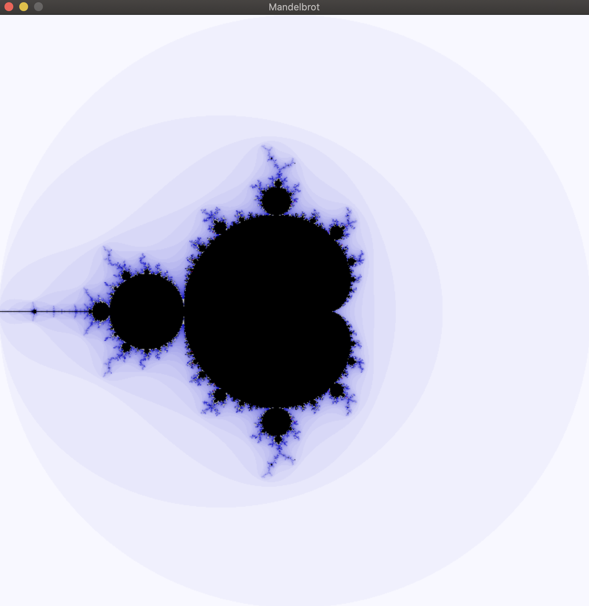
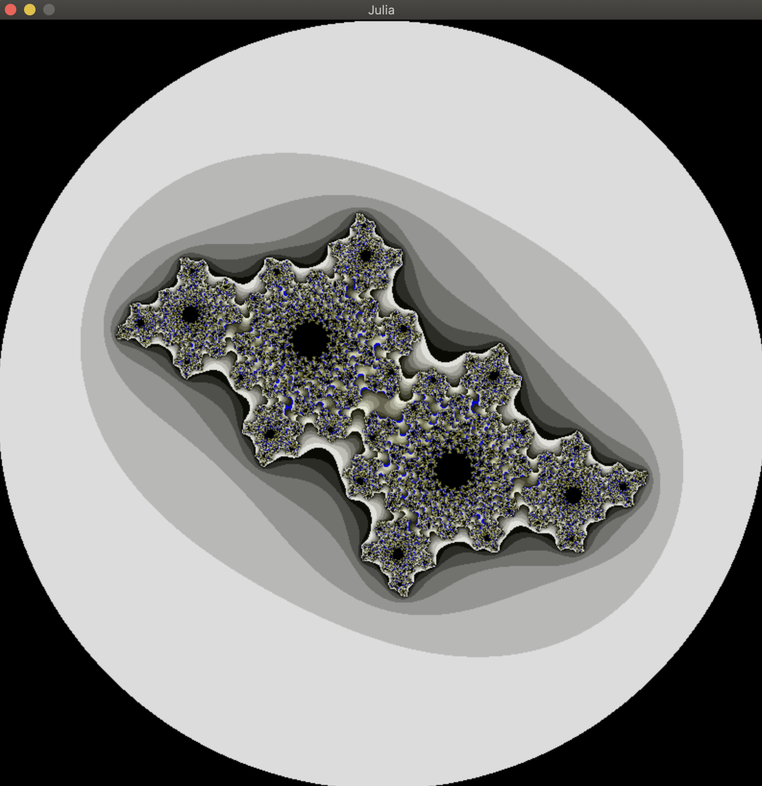

> # 🌀 fract-ol

MiniLibX 그래픽 라이브러리를 사용하여 프랙탈 그리기

`Mandelbrot`


## ✅ Mandatory part

- 줄리아(Julia), 만델브로트(Madelbrot) 집합 렌더링 하기
- 마우스 휠로 무한 줌 인/아웃을 지원합니다.

<br>

## ✅ Bonus part

- 다른 프랙탈 추가하기
- 줌이 마우스 위치 따라가도록 구현하기
- 화살표 키로 화면 이동 기능 추가하기
- 색상 변환 효과 추가하기

<br>

## 🎮 실행 방법

MacOS 환경에서만 테스트되었습니다. 다른 운영체제에서 테스트 할 경우 [42 Docs](https://harm-smits.github.io/42docs/libs/minilibx/getting_started.html)를 확인해야 합니다.

1. 프로그램 설치 및 컴파일

```shell
git clone https://github.com/GCgang/fract-ol.git && cd fract-ol && make
```

2. 프랙탈 실행하기

```
./fractol <type> <options>
```

`Mandelbrot 프랙탈`

```shell
./fractal Mandelbrot
```

`Julia 프랙탈`

```shell
./fractal Julia -0.4 0.6
```

`Burningship 프랙탈`

```shell
./fractal Burningship
```

<table> <tr><td><kbd>&nbsp;▲&nbsp;</kbd><kbd>&nbsp;◄&nbsp;</kbd><kbd>&nbsp;▼&nbsp;</kbd><kbd>&nbsp;►&nbsp;</kbd></td><td>이동</td></tr> <tr><td><kbd>&nbsp;스크롤 휠&nbsp;</kbd></td><td>줌 인/아웃</td></tr> <tr><td><kbd>&nbsp;1&nbsp;</kbd>, <kbd>&nbsp;2&nbsp;</kbd>, <kbd>&nbsp;3&nbsp;</kbd>, <kbd>&nbsp;4&nbsp;</kbd>, <kbd>&nbsp;5&nbsp;</kbd></td><td>색상 테마 변경</td></tr> <tr><td><kbd>&nbsp;esc&nbsp;</kbd> 또는 창 닫기</td><td>Fract-ol 종료</td></tr> </table>

<br>

## ✏️ Review

- 간단한 그래픽 프로그램을 만드는 과정을 통해 컴퓨터 그래픽스에 대한 기초적인 것들을 배울 수 있었습니다.
- 간단한 이벤트를 처리하며 사용자 입력에 반응하도록 구현하는 방법을 배울 수 있었습니다.

<br>

## 📷 스크린샷

`Julia`


`BurningShip`

